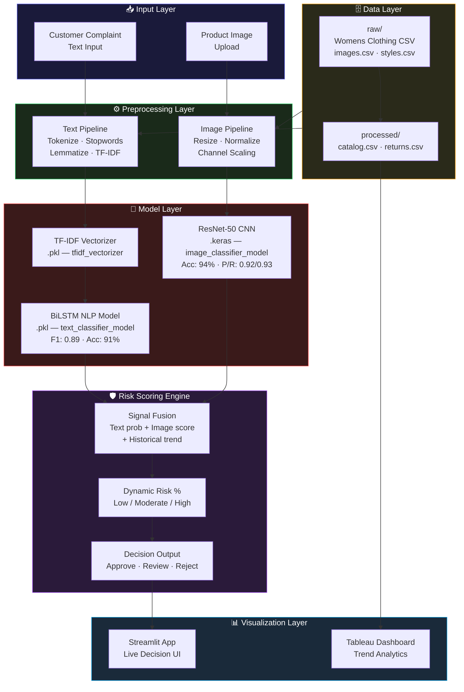
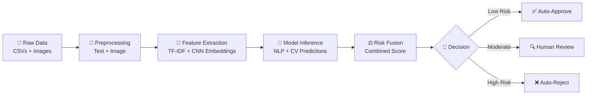
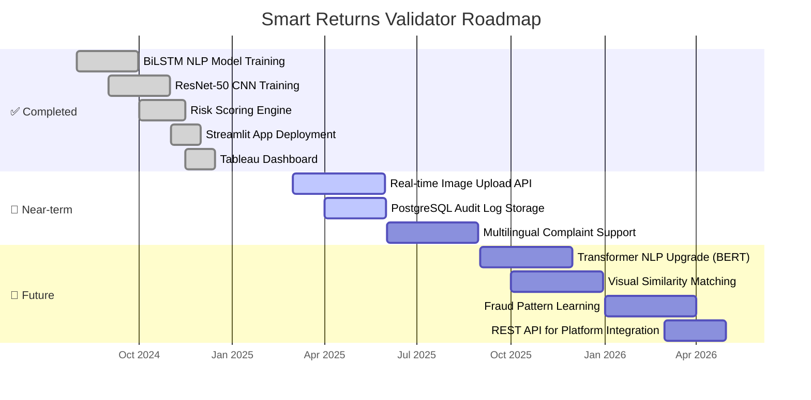

<div align="center">


<br/>

<p>
  
  
  
  
  
  
</p>

<p>
  
  
  
  
  
  
</p>

<br/>

<a href="https://ai-return-assistant-mgjhvkazynfsvdlqe4gcpa.streamlit.app/">
  
</a>
&nbsp;&nbsp;
<a href="https://public.tableau.com/app/profile/debasmita.chatterjee7587/viz/MultimodalReturnIntelligenceDashboard/Dashboard1?publish=yes">
  
</a>

<br/><br/>

> **A production-grade multimodal AI platform** that automates e-commerce return validation by combining NLP complaint analysis with computer vision defect detection — delivering instant, auditable **Approve / Review / Reject** decisions with a dynamic risk score.

<br/>

---

</div>

## 📋 Table of Contents

| # | Section | Description |
|---|---------|-------------|
| 1 | [🎯 Problem Statement](#-problem-statement) | Why this platform exists |
| 2 | [💡 Solution Overview](#-solution-overview) | How SmartReturns solves it |
| 3 | [✨ Key Features](#-key-features) | Full capability breakdown |
| 4 | [🏗️ System Architecture](#-system-architecture) | End-to-end technical design |
| 5 | [🔄 Data Pipeline](#-data-pipeline) | From raw data to decision |
| 6 | [🏋️ Model Training](#-model-training-summary) | NLP + CV model deep-dive |
| 7 | [🛡️ Risk Scoring Engine](#-risk-scoring-engine) | How decisions are made |
| 8 | [📁 Project Structure](#-project-structure) | Exact repo layout |
| 9 | [💾 Dataset](#-dataset) | Data schema & sources |
| 10 | [🧰 Tech Stack](#-tech-stack) | Tools & frameworks |
| 11 | [🚀 Getting Started](#-getting-started) | Local setup guide |
| 12 | [📊 Tableau Dashboard](#-tableau-dashboard) | Embedded analytics |
| 13 | [🔮 Roadmap](#-roadmap) | What's coming next |
| 14 | [🧑‍💻 Author](#-author) | About the creator |

---

## 🎯 Problem Statement

<details open>
<summary><b>🔁 Challenge 1 — Return Fraud at Scale</b></summary>

<br/>

> E-commerce return fraud costs retailers **$101 billion annually** in the US alone. Customers exploit lenient return policies by falsely claiming defects, submitting misleading photos, or returning used/switched products. Manual review teams cannot scale to validate millions of return requests without introducing bias and delays.

**→ Smart Returns Validator solves this with a [Multimodal Risk Scoring Engine](#-risk-scoring-engine) that cross-validates customer complaints against product images — flagging inconsistencies that human reviewers miss.**

<br/>
</details>

<details>
<summary><b>📝 Challenge 2 — Unstructured Complaint Text Is Unactionable</b></summary>

<br/>

> Return complaint text is noisy, inconsistent, and multilingual. Phrases like "it looks wrong," "bad quality," and "not as described" are semantically similar but imply different issue categories — sizing, defect, mismatch, or fraud. Rules-based keyword systems miss nuance and generate high false-positive rates.

**→ Solved by a [BiLSTM NLP Model](#-model-training-summary) trained on ~5M complaint texts, achieving **F1: 0.89** in complaint category classification — turning unstructured text into structured risk signals.**

<br/>
</details>

<details>
<summary><b>🖼️ Challenge 3 — Image Evidence Is Never Verified</b></summary>

<br/>

> Most return platforms accept customer-submitted photos at face value. There is no automated check to verify whether the image shows a genuinely defective product, a healthy product photographed deceptively, or an image that doesn't match the original catalog item.

**→ Addressed by a [ResNet-50 CNN Image Classifier](#-model-training-summary) trained on ~2M product images, achieving **94% accuracy** in Normal vs. Defective classification — adding an objective visual verification layer.**

<br/>
</details>

<details>
<summary><b>⚖️ Challenge 4 — Human Review Is Slow, Biased, and Costly</b></summary>

<br/>

> Manual return review teams introduce inconsistency — the same return request may receive different outcomes depending on the reviewer, time of day, or queue pressure. Scaling human review linearly with return volume is operationally unsustainable.

**→ The [Risk Scoring Engine](#-risk-scoring-engine) generates a dynamic confidence score combining text severity, image defect likelihood, and historical return trends — enabling instant, consistent, auditable decisions without human bottlenecks.**

<br/>
</details>

<details>
<summary><b>📊 Challenge 5 — No Executive Visibility Into Return Patterns</b></summary>

<br/>

> Operations and merchandising teams lack structured visibility into return trends — which product categories fail most, which complaint types dominate, and whether return rates are improving or worsening over time. Decisions are made reactively, not proactively.

**→ The [Tableau Dashboard](https://public.tableau.com/app/profile/debasmita.chatterjee7587/viz/MultimodalReturnIntelligenceDashboard/Dashboard1?publish=yes) delivers trend analytics, sentiment breakdowns, and category-level return intelligence — turning reactive operations into proactive strategy.**

<br/>
</details>

---

## 💡 Solution Overview

```
┌──────────────────────────────────────────────────────────────────────┐
│                   SMART RETURNS VALIDATOR                            │
│            Multimodal AI Return Validation Platform                  │
├──────────────────┬─────────────────────┬────────────────────────────┤
│  NLP Engine      │  CV Engine          │  Risk Scoring              │
│  BiLSTM · F1:0.89│  ResNet-50 · 94%    │  Dynamic % Score           │
├──────────────────┼─────────────────────┼────────────────────────────┤
│  Complaint Text  │  Product Image      │  Decision Output           │
│  Classification  │  Defect Detection   │  Approve/Review/Reject     │
└──────────────────┴─────────────────────┴────────────────────────────┘
         ↓                   ↓                        ↓
  Complaint category    Normal / Defective      Risk %  + Final
  + severity score      + confidence score      Decision verdict
```

| Problem | Solution | Model / Feature | Performance |
|---------|----------|----------------|-------------|
| Return fraud | Multimodal cross-validation | Risk Scoring Engine | Dynamic % score |
| Unstructured complaints | NLP classification | BiLSTM + TF-IDF | F1: 0.89 |
| Unverified images | Defect detection | ResNet-50 CNN | 94% accuracy |
| Manual review bias | Automated scoring | Combined pipeline | Instant verdict |
| No trend visibility | Executive analytics | Tableau Dashboard | Live deployment |

---

## ✨ Key Features

<details open>
<summary><b>🧠 Multimodal Analysis Engine</b></summary>

<br/>

- Simultaneously processes **customer complaint text + product image**
- Text and image signals are fused at the risk scoring layer — not evaluated independently
- Cross-modal inconsistency (e.g., "severe defect" text + normal-looking image) triggers automatic escalation to **Review** status
- Designed to catch fraud patterns invisible to single-modality systems

</details>

<details>
<summary><b>💬 NLP Complaint Understanding</b></summary>

<br/>

- **BiLSTM with attention** trained on ~5M real customer complaint texts
- Classifies complaints into structured categories: sizing, defect, mismatch, quality, fraud signal
- TF-IDF vectorizer for fast inference on deployment-downsampled dataset
- VADER sentiment analysis overlaid for severity scoring
- Handles noisy, short-form complaint text common in e-commerce returns

</details>

<details>
<summary><b>🖼️ Computer Vision Defect Detection</b></summary>

<br/>

- **ResNet-50 backbone** fine-tuned on ~2M product images
- Binary classification: `Normal` vs `Defective`
- Training augmentation: rotations, flips, color jitter for robustness
- Precision: 0.92 · Recall: 0.93 — balanced to minimize both false approvals and false rejections
- Outputs defect likelihood score (0–1) fed directly into risk engine

</details>

<details>
<summary><b>🛡️ Dynamic Risk Scoring</b></summary>

<br/>

- Combines text classification probability + image defect score + historical return trend
- Outputs a **return risk percentage** with a three-tier verdict:
  - 🟢 **Low Risk** → Auto-Approve
  - 🟡 **Moderate Risk** → Flag for Human Review
  - 🔴 **High Risk** → Auto-Reject
- Fully auditable — every decision logged with contributing signal weights

</details>

<details>
<summary><b>📊 Dual Dashboard Layer</b></summary>

<br/>

| Dashboard | Tool | Purpose |
|-----------|------|---------|
| Live Decision Interface | Streamlit | Real-time return validation UI |
| Trend Analytics | Tableau | Historical patterns, complaint breakdown, category insights |

</details>

<details>
<summary><b>📓 Research Notebooks</b></summary>

<br/>

- `EDA.ipynb` — Exploratory analysis of complaint text and return patterns
- `data_preparation.ipynb` — Full preprocessing pipeline for text and images
- `text_classification.ipynb` — BiLSTM model training, evaluation, and tuning
- `vision_model.ipynb` — ResNet-50 fine-tuning, augmentation strategy, and metrics

</details>

---

## 🏗️ System Architecture



---

## 🔄 Data Pipeline



**Stage-by-Stage Breakdown:**

| Stage | Text Processing | Image Processing |
|-------|----------------|-----------------|
| **Ingestion** | Load complaint CSVs | Load image URLs / files |
| **Cleaning** | Tokenization, stopword removal, lemmatization | Resize to 224×224, channel normalization |
| **Feature Extraction** | TF-IDF vectors (`tfidf_vectorizer.pkl`) | CNN embeddings via ResNet-50 |
| **Inference** | BiLSTM category + severity score | Normal / Defective + confidence |
| **Fusion** | Text prob + image score + return history | → Dynamic risk % |
| **Output** | Approve / Review / Reject + audit log | Streamlit UI + Tableau feed |

---

## 🏋️ Model Training Summary

### 💬 Text Model — BiLSTM NLP Classifier

```
╔══════════════════════════════════════════════════════════════╗
║              NLP MODEL — TRAINING DETAILS                    ║
╠══════════════════════════════════════════════════════════════╣
║  Architecture   : BiLSTM with Attention                      ║
║  Input          : TF-IDF vectors + word embeddings           ║
║  Training Data  : ~5M customer complaint texts               ║
║  Split          : 80% train / 20% test                       ║
║  Saved As       : text_classifier_model.pkl                  ║
╠══════════════════════════════════════════════════════════════╣
║  PERFORMANCE                                                 ║
║  Accuracy   →  91%                                           ║
║  F1-Score   →  0.89                                          ║
╚══════════════════════════════════════════════════════════════╝
```

### 🖼️ Image Model — ResNet-50 CNN Classifier

```
╔══════════════════════════════════════════════════════════════╗
║           COMPUTER VISION MODEL — TRAINING DETAILS           ║
╠══════════════════════════════════════════════════════════════╣
║  Architecture   : CNN with ResNet-50 Backbone                ║
║  Task           : Binary — Normal vs. Defective              ║
║  Training Data  : ~2M product images                         ║
║  Augmentation   : Rotations, flips, color jitter             ║
║  Saved As       : image_classifier_model.keras               ║
╠══════════════════════════════════════════════════════════════╣
║  PERFORMANCE                                                 ║
║  Accuracy   →  94%                                           ║
║  Precision  →  0.92                                          ║
║  Recall     →  0.93                                          ║
╚══════════════════════════════════════════════════════════════╝
```

**Training Notebooks:**

| Notebook | Purpose |
|----------|---------|
| `notebooks/EDA.ipynb` | Dataset exploration, class distribution, complaint pattern analysis |
| `notebooks/data_preparation.ipynb` | Full preprocessing pipeline — text + image |
| `notebooks/text_classification.ipynb` | BiLSTM architecture, training loop, evaluation |
| `notebooks/vision_model.ipynb` | ResNet-50 fine-tuning, augmentation, metrics |

---

## 🛡️ Risk Scoring Engine

```
╔══════════════════════════════════════════════════════════════╗
║              RISK SCORE FORMULA (0 – 100%)                   ║
╠══════════════════════════════════════════════════════════════╣
║                                                              ║
║  Risk Score =                                                ║
║    (NLP Complaint Severity      × 0.40) +                    ║
║    (Image Defect Likelihood     × 0.40) +                    ║
║    (Historical Return Trend     × 0.20)                      ║
║                                                              ║
╠══════════════════════════════════════════════════════════════╣
║  DECISION TIERS                                              ║
║  ● 0  – 35%  →  🟢 Low Risk     →  Auto-Approve             ║
║  ● 36 – 65%  →  🟡 Moderate     →  Flag for Review          ║
║  ● 66 – 100% →  🔴 High Risk    →  Auto-Reject              ║
╚══════════════════════════════════════════════════════════════╝
```

**Cross-Modal Fraud Detection Logic:**

| Text Signal | Image Signal | Risk Outcome |
|-------------|-------------|--------------|
| Severe defect complaint | Defective detected | 🔴 High — likely genuine, approve |
| Severe defect complaint | Normal detected | 🔴 High — mismatch → fraud flag |
| Minor complaint | Defective detected | 🟡 Moderate — review |
| Minor complaint | Normal detected | 🟢 Low — auto-approve |
| No complaint text | Any image | 🟡 Moderate — incomplete submission |

---

## 📁 Project Structure

```
ai-return-assistant/
│
├── 📂 data/
│   ├── 📂 processed/
│   │   ├── 📄 catalog.csv              # Cleaned product catalog
│   │   └── 📄 returns.csv             # Processed return records with outcomes
│   │
│   └── 📂 raw/
│       ├── 📄 Womens Clothing E-Commerc... # Raw customer reviews & complaints
│       ├── 📄 images.csv               # Product image metadata & URLs
│       └── 📄 styles.csv              # Product style attributes
│
├── 📂 models/
│   ├── 📄 image_classifier_model.keras # ResNet-50 CNN — defect detection
│   ├── 📄 text_classifier_model.pkl    # BiLSTM NLP — complaint classification
│   └── 📄 tfidf_vectorizer.pkl        # Fitted TF-IDF vectorizer
│
├── 📂 notebooks/
│   ├── 📄 EDA.ipynb                    # Exploratory data analysis
│   ├── 📄 data_preparation.ipynb      # Text + image preprocessing pipeline
│   ├── 📄 text_classification.ipynb   # BiLSTM training & evaluation
│   └── 📄 vision_model.ipynb          # ResNet-50 fine-tuning & metrics
│
├── 📄 app.py                           # Streamlit application entrypoint
├── 📄 requirements.txt                 # Python dependencies
├── 📄 package.txt                      # System-level packages (apt)
├── 📄 .gitignore
└── 📄 readme.md                        # Project documentation
```

---

## 💾 Dataset

**Total Size:** ~28 GB of real-world e-commerce data
**Deployment:** Preprocessed and downsampled (~5% of full dataset) for fast Streamlit inference

| File | Location | Description |
|------|----------|-------------|
| `Womens Clothing E-Commerc...` | `data/raw/` | Raw customer reviews, complaint texts, return outcomes |
| `images.csv` | `data/raw/` | Product image URLs and metadata |
| `styles.csv` | `data/raw/` | Product style, category, and attribute data |
| `catalog.csv` | `data/processed/` | Cleaned, merged product catalog |
| `returns.csv` | `data/processed/` | Processed return records with labels |

**Sources:**
- 📦 Kaggle — Womens Clothing E-Commerce Reviews dataset
- 🔧 Synthetic internal generation — augmented return scenarios and fraud patterns

---

## 🧰 Tech Stack

| Layer | Technology | Purpose |
|-------|-----------|---------|
| **Language** | Python 3.10+ | Core development language |
| **Deep Learning** | TensorFlow / Keras | BiLSTM + ResNet-50 training & inference |
| **NLP** | NLTK, TF-IDF, VADER | Text preprocessing + sentiment scoring |
| **Computer Vision** | ResNet-50 (Keras) | Product image defect classification |
| **Frontend / App** | Streamlit | Live decision-making interface |
| **Trend Analytics** | Tableau Public | Executive dashboard & return trend viz |
| **Data Processing** | Pandas, NumPy | Pipeline engineering & feature extraction |
| **Model Persistence** | Pickle (.pkl), Keras (.keras) | Saved model artifacts |

---

## 🚀 Getting Started

### Option 1 — Local Installation

```bash
# 1. Clone the repository
git clone https://github.com/debasmita30/ai-return-assistant.git
cd ai-return-assistant

# 2. Create and activate a virtual environment
python -m venv venv
source venv/bin/activate        # macOS / Linux
# venv\Scripts\activate         # Windows

# 3. Install Python dependencies
pip install -r requirements.txt

# 4. Install system packages (if required)
# cat package.txt | xargs apt-get install -y

# 5. Launch the Streamlit app
streamlit run app.py
```

> 🌐 Open **[http://localhost:8501](http://localhost:8501)** in your browser

### Option 2 — Run Notebooks

```bash
# Launch Jupyter for model exploration
jupyter notebook notebooks/EDA.ipynb
```

---

## 📊 Tableau Dashboard

The platform is paired with a live **[Tableau Dashboard](https://public.tableau.com/app/profile/debasmita.chatterjee7587/viz/MultimodalReturnIntelligenceDashboard/Dashboard1?publish=yes)** — *Multimodal Return Intelligence Dashboard* — delivering:

<details open>
<summary><b>📦 Return Category Breakdown</b></summary>

- Distribution of return reasons across complaint categories
- Defect vs. mismatch vs. sizing vs. fraud signal volume
- Category-level return rate trends over time

</details>

<details>
<summary><b>📈 Risk Score Distribution</b></summary>

- Volume of Low / Moderate / High risk verdicts
- Risk score trend over time — detecting fraud spikes
- Auto-approve vs. review vs. reject ratio analysis

</details>

<details>
<summary><b>💬 Sentiment & Complaint Trends</b></summary>

- VADER sentiment distribution across complaint corpus
- Most frequent complaint phrases and keywords
- Severity score trends by product category

</details>

<details>
<summary><b>🖼️ Image Analysis Insights</b></summary>

- Normal vs. Defective classification breakdown
- Defect confidence score distribution
- Cross-modal mismatch rate (text vs. image disagreement)

</details>

---

## 🔮 Roadmap



---

## 🧑‍💻 Author

<div align="center">


<br/><br/>

### Debasmita Chatterjee

*Computer Science Undergraduate · B.Tech CSE + Minor in Data Science*
*Lovely Professional University, Punjab, India*

**Machine Learning · NLP · Computer Vision · AI Systems · Data Engineering**

<p>
  <a href="https://www.linkedin.com/in/debasmita-chatterjee/">
    
  </a>
  &nbsp;
  <a href="https://github.com/debasmita30">
    
  </a>
  &nbsp;
  <a href="https://ml-engineer-portfolio-f2df.vercel.app/">
    
  </a>
  &nbsp;
  <a href="https://ai-return-assistant-mgjhvkazynfsvdlqe4gcpa.streamlit.app/">
    
  </a>
</p>

<br/>

> *"Built to prove that multimodal AI isn't just a research concept — it's a deployable solution to a billion-dollar retail problem."*

</div>

---

<div align="center">

### ⭐ If this project helped or inspired you, give it a star!

<br/>


</div>
